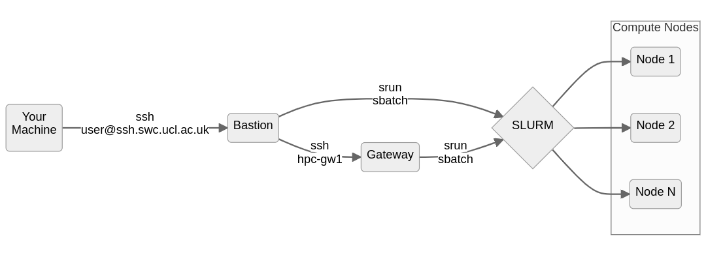

# Set up SSH for the SWC HPC cluster

This guide explains how to connect to the SWC's HPC cluster via SSH.

```{include} ../_static/swc-wiki-warning.md
```

```{include} ../_static/code-blocks-note.md
```

## Abbreviations
| Acronym | Meaning |
| --- | --- |
| SWC | Sainsbury Wellcome Centre |
| HPC | High Performance Computing |
| SLURM | Simple Linux Utility for Resource Management |
| SSH | Secure (Socket) Shell protocol |
| IDE | Integrated Development Environment |
| GUI | Graphical User Interface |

## Prerequisites
- You have a SWC account and know your username and password.
- You have read the [SWC wiki's section on High Performance Computing (HPC)](https://wiki.ucl.ac.uk/display/SSC/High+Performance+Computing), especially the [Logging into the Cluster page](https://wiki.ucl.ac.uk/display/SSC/Logging+into+the+Cluster).
- You have an SSH client installed on your computer. This is usually pre-installed on Linux and macOS, but not on Windows. If you are using Windows, we recommend intalling [Git Bash](https://gitforwindows.org/).
- You know the basics of using the command line, i.e. using the terminal (Git Bash on Windows) to navigate the file system and run commands.

## Log into the cluster
Run the following commands on the terminal (typing your `<SWC-PASSWORD>` both times when prompted):
```{code-block} console
$ ssh <SWC-USERNAME>@ssh.swc.ucl.ac.uk
$ ssh hpc-gw1
```
::: {note}
You have now successfully logged into the cluster 🎉. You may stop reading here.

{bdg-warning}`BUT`

If you want to learn more about why we had to SSH twice, read the [next section](#why-do-we-ssh-twice).

If you want to make you life easier, you can set yourself up with an [SSH config file](#ssh-config-file) 
and some [SSH keys](#ssh-keys). Trust us, it's worth the effort. For example, one
benefit is that you will be able to use [Visual Studio Code](https://code.visualstudio.com/)
on your PC/laptop to edit files on the cluster. See the [last section](#remote-development) for details.
:::

## Why do we SSH twice?
We first need to distinguish the different types of nodes on the SWC HPC system:

- the *bastion* node (or "jump host") - `ssh.swc.ucl.ac.uk`. This serves as a single entry point to the cluster from external networks. By funneling all external SSH connections through this node, it's easier to monitor, log, and control access, reducing the attack surface. The *bastion* node has very little processing power. It can be used to submit and monitor SLURM jobs, but it shouldn't be used for anything else.
- the *gateway* node - `hpc-gw1`. This is a more powerful machine and can be used for light processing, such as editing your scripts, creating and copying files etc. However don't use it for anything computationally intensive, since this node's resources are shared across all users.
- the *compute* nodes - `enc1-node10`, `gpu-sr670-21`, etc. These are the machinces that actually run the jobs we submit, either interactively via `srun` or via batch scripts submitted with `sbatch`.



Your home directory, as well as the locations where filesystems like `ceph` are mounted, are shared across all of the nodes.

The first `ssh` command - `ssh <SWC-USERNAME>@ssh.swc.ucl.ac.uk` only takes you to the *bastion* node. A second command - `ssh hpc-gw1` - is needed to reach the *gateway* node.

Similarly, if you are on the *gateway* node, typing `logout` once will only get you one layer outo the *bastion* node. You need to type `logout` again to exit the *bastion* node and return to your local machine.

The *compute* nodes should only be accessed via the SLURM `srun` or `sbatch` commands. This can be done from either the *bastion* or the *gateway* nodes. If you are running an interactive job on one of the *compute* nodes, you can terminate it by typing `exit`. This will return you to the node from which you entered.

## SSH config file
If you find yourself typing the above commands over and over again, you can make
your life easier by editing the SSH config file. 
This is a text file that lives in your home directory and contains a list of aliases
for SSH connections.

On your local PC/Laptop, open a terminal (Git Bash on Windows) and navigate to the
`.ssh` folder in your user's home `~` directory:
```{code-block} console
$ cd ~/.ssh
```

List the files in this directory:
```{code-block} console
$ ls -1
authorized_keys
config
known_hosts
```
Some of these files may not exist yet. Next we will open the `config` file
using the terminal text editor `nano`:
```{code-block} console
$ nano config
```
If the file doesn't exist yet, it will be created. 
Add the following lines to the file:

```{code-block} bash
:caption: config

# Specify our intermediate jump host, aka the bastion node
Host swc-bastion
    HostName ssh.swc.ucl.ac.uk
    User <SWC-USERNAME>

# Specify how to get to the gateway node by jumping through the bastion node
# The gateway hostname is specified as the jump-host would see it
Host swc-gateway
    HostName hpc-gw1
    User <SWC-USERNAME>
    ProxyCommand ssh -W %h:%p swc-bastion
```

Save the file by pressing `Ctrl+O`, then `Enter`.
Exit the `nano` editor by pressing `Ctrl+X`.

From now on, you can directly SSH into the *gateway* node by typing:
```{code-block} console
$ ssh swc-gateway
```
You can also use the same syntax to SSH into the *bastion* node:
```{code-block} console
$ ssh swc-bastion
```
In both cases, one `logout` command will return you to your local machine.

## SSH keys
If you are bored of typing your password every time you SSH into the cluster,
you can set up authentication via SSH keys. You will have to do some work
upfront, but it will save you tons of time in the long run. Plus, it's more secure.

::: {dropdown} How does SSH key authentication work?
:color: info
:icon: info
You generate a pair of keys locally - a public and a private one - 
and then copy the public key to the remote machine.
When you try to SSH into the remote machine, the SSH client on your local machine
will use the private key to generate a signature, which the SSH server on the
remote machine will verify using the public key. If the signature is valid,
you will be granted access.

There are several cryptographic algorithms that can be used to generate the keys.
They can be selected using the `-t` argument of the `ssh-keygen` command.
In the following example, we use `ed25519`, as it strikes a good balance between 
security and speed for most use cases.
:::

To generate a pair of SSH keys, run the following command on your local machine:
```{code-block} console
$ ssh-keygen -t ed25519
```

You will be prompted to enter a file path for the key. You may accept the 
default - `~/.ssh/id_ed25519` - or choose another path/name.

Next, you will be prompted to enter a passphrase.
This is an extra layer of security, but you can leave it blank if you want.

There are now two new files in the `.ssh` directory:
```{code-block} console
:emphasize-lines: 5,6
$ cd ~/.ssh
$ ls -1
authorized_keys
config
id_ed25519
id_ed25519.pub
known_hosts
```

The `id_ed25519` file is your private key - {bdg-warning}`It should never be shared with anyone`.

The `id_ed25519.pub` file is your public key. This is the one you will copy to
the remote machines. Le'ts do that now:

```{code-block} console
$ ssh-copy-id -i id_ed25519.pub swc-bastion
$ ssh-copy-id -i id_ed25519.pub swc-gateway
```

The above commands will copy your public key both to the *bastion* and *gateway* nodes.
The key will be added to the `.ssh/authorized_keys` file on each node. The 
`ssh-copy-id` command uses the configuration we previously set up
in the `config` file to figure out how to reach the two remote machines.

🎉 Congrats! You can now directly SSH into the *gateway* node without typing your password:
```{code-block} console
$ ssh swc-gateway
```
In case you want to SSH into the *bastion* node, you can do so by typing:
```{code-block} console
$ ssh swc-bastion
```

::: {warning}
In most cases, you don't need to explicitly specify the location of the private key 
in your `~/.ssh/config` file because SSH will automatically look for the default key names 
(like `id_rsa`, `id_ed25519`, etc.) in the `~/.ssh` directory.

However, if you're using a non-default name or location for your private key, 
or if you have multiple keys and want to specify which one to use for a particular host, 
then you can use the `IdentityFile` directive in your `~/.ssh/config` to 
point to the private key.

For example, if you have a private key with a custom name `<MY-SPECIAL-KEY>`
in the `~/.ssh` directory, you can add the following lines to your `~/.ssh/config` file:


```{code-block} bash
:caption: config
:emphasize-lines: 5,13

# Specify our intermediate jump host, aka the bastion node
Host swc-bastion
    HostName ssh.swc.ucl.ac.uk
    User <SWC-USERNAME>
    IdentityFile ~/.ssh/<MY-SPECIAL-KEY>

# Specify how to get to the gateway node by jumping through the bastion node
# The gateway hostname is specified as the jump-host would see it
Host swc-gateway
    HostName hpc-gw1
    User <SWC-USERNAME>
    ProxyCommand ssh -W %h:%p swc-bastion
    IdentityFile ~/.ssh/<MY-SPECIAL-KEY>
```
:::

## Remote development
One benefit of setting your SSH config and SSH keys is that you can now easily use
[Visual Studio Code](https://code.visualstudio.com/) to edit files on remote machines.
This is especially useful for editing scripts on the *gateway* node that you want to
run on the *compute* nodes of the cluster.

To do this, you need to install the [Remote - SSH](https://marketplace.visualstudio.com/items?itemName=ms-vscode-remote.remote-ssh) extension in VS Code. Then, when you 
click on the "Open a Remote Window" button in the bottom left corner of the VS Code window,
you will see a list of the SSH hosts you have configured in your `~/.ssh/config` file.
You can then select the host you want to connect to - e.g. `swc-gateway` - and VS Code 
will open a new window with a terminal connected to that host. You can then use the
VS Code GUI to navigate the file system and edit files on the remote machine.

Other IDEs like [PyCharm](https://www.jetbrains.com/pycharm/) also offer 
[similar functionality](https://www.jetbrains.com/help/pycharm/remote-development-overview.html).