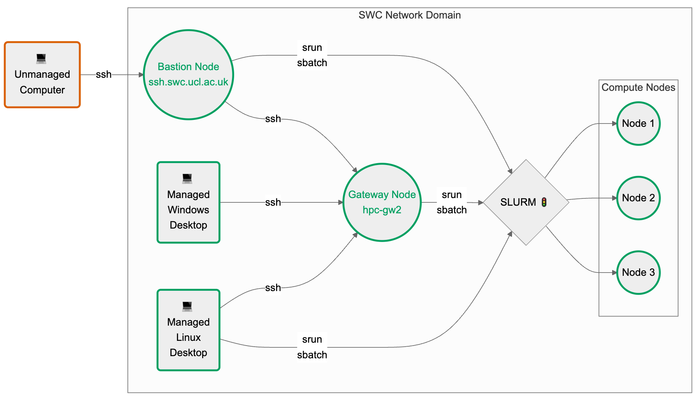

(ssh-cluster-target)=
# Set up SSH for the SWC HPC cluster

This guide explains how to connect to the SWC's HPC cluster via SSH from
any personal computer.

If you have access to a desktop managed by the SWC's IT team
the connection is much more straightforward than described here
(see the [note on managed desktops](ssh-managed-target)).

```{include} ../_static/swc-wiki-warning.md
```

```{include} ../_static/code-blocks-note.md
```

## Abbreviations
| Acronym                                                                 | Meaning                                      |
| ----------------------------------------------------------------------- | -------------------------------------------- |
| [SSH](https://en.wikipedia.org/wiki/Secure_Shell)                       | Secure (Socket) Shell protocol               |
| [SWC](https://www.sainsburywellcome.org/web/)                           | Sainsbury Wellcome Centre                    |
| [HPC](https://en.wikipedia.org/wiki/High-performance_computing)         | High Performance Computing                   |
| [IT](https://en.wikipedia.org/wiki/Information_technology)              | Information Technology                       |
| [SLURM](https://slurm.schedmd.com/)                                     | Simple Linux Utility for Resource Management |
| [IDE](https://en.wikipedia.org/wiki/Integrated_development_environment) | Integrated Development Environment           |
| [GUI](https://en.wikipedia.org/wiki/Graphical_user_interface)           | Graphical User Interface                     |

## Prerequisites
- You have an SWC account and know your username and password.
- You have read the [SWC wiki's section on High Performance Computing (HPC)](https://wiki.ucl.ac.uk/display/SSC/High+Performance+Computing), especially the [Logging into the Cluster page](https://wiki.ucl.ac.uk/display/SSC/Logging+into+the+Cluster).
- You know the basics of using the command line, i.e. using the terminal to navigate the file system and run commands.
- You have an SSH client installed on your computer. This is usually pre-installed on Linux and macOS. SSH is also available on Windows (since Windows 10), however some steps will differ. If you are a Windows user, read the note below before proceeding.

::: {dropdown} Note for Windows users
:color: info
:icon: info

You have two options on how to proceed:

1. Install [Git Bash](https://gitforwindows.org/), which emulates a Linux terminal on Windows and includes tools that are not available on Windows by default, such as `nano`, and `ssh-copy-id`. This is the recommended option, as it will allow you to follow along with all commands in this guide, as they are presented. Just assume that all commands are run in Git Bash.

2. If you are using Windows 10 or newer, you can follow this guide (except for the section on [SSH keys](#ssh-keys)) using native Windows functionalities as described here.


    To [Log into the cluster](#log-into-the-cluster), you can use the same commands as in the guide below, but typed in the Windows `cmd`:
    ```{code-block} console
    :caption: cmd
    ssh <SWC-USERNAME>@ssh.swc.ucl.ac.uk
    ssh hpc-gw2
    ```

    The [SSH config file](#ssh-config-file) section can be followed using the file browser and Notepad, instead of the terminal and `nano`.
    Create the `.ssh` folder in you home directory, i.e. `C:\Users\<USERNAME>\.ssh`,
    if it does not already exist (don't forget the `.` at the start of `.ssh`).

    You may create and edit the `config` file with Notepad but beware that the file must not have an extension.
    To create a file without an extension in Windows, you need to make the file extensions visible
    (click 'View' in the file browser and check the box 'File name extensions').
    The `config` file contents should be the same as in the guide below.

    In day-to-day use, you can use the `ssh swc-gateway` and `ssh swc-bastion` commands natively in Windows `cmd`,
    provided that you have defined those aliases in your `config` file, as this guide describes.
:::

## Log into the cluster
Run the following commands on the terminal, typing your `<SWC-PASSWORD>` both times when prompted
(your password will not be displayed on the screen):

```{code-block} console
$ ssh <SWC-USERNAME>@ssh.swc.ucl.ac.uk
$ ssh hpc-gw2
```
You have now successfully logged into the cluster 🎉. You may stop reading here, but...

::: {note}
If you want to learn more about why we had to SSH twice, read the [next section](#why-do-we-ssh-twice).

If you want to make you life easier, you can set yourself up with an [SSH config file](#ssh-config-file)
and some [SSH keys](#ssh-keys).
:::

## Why do we SSH twice?
We first need to distinguish the different types of nodes on the SWC HPC system:

- the *bastion* node (or *login node*) - `ssh.swc.ucl.ac.uk`. This serves as a single entry point to the cluster from external networks. By funneling all external SSH connections through this node, it's easier to monitor, log, and control access, reducing the attack surface. The *bastion* node has very little processing power. It can be used to submit and monitor SLURM jobs, but it shouldn't be used for anything else.
- the *gateway* node - `hpc-gw2`. This is a more powerful machine and can be used for light processing, such as editing your scripts, creating and copying files etc. However don't use it for anything computationally intensive, since this node's resources are shared across all users.
- the *compute* nodes - `enc1-node10`, `gpu-sr670-21`, etc. These are the machinces that actually run the jobs we submit, either interactively via `srun` or via batch scripts submitted with `sbatch`.


Your home directory, as well as the locations where filesystems like `ceph` are mounted, are shared across all of the nodes.

The first `ssh` command - `ssh <SWC-USERNAME>@ssh.swc.ucl.ac.uk` only takes you to the *bastion* node. A second command - `ssh hpc-gw2` - is needed to reach the *gateway* node.

Similarly, if you are on the *gateway* node, typing `logout` once will only get you one layer outo the *bastion* node. You need to type `logout` again to exit the *bastion* node and return to your local machine.

The *compute* nodes should only be accessed via the SLURM `srun` or `sbatch` commands. This can be done from either the *bastion* or the *gateway* nodes. If you are running an interactive job on one of the *compute* nodes, you can terminate it by typing `exit`. This will return you to the node from which you entered.

:::{dropdown} Be mindful of node usage
:color: warning
:icon: alert

Avoid running heavy computations on the *bastion* or *gateway* nodes, as
they are meant for light tasks like text editing or job submissions to SLURM.

For quick tasks that may burden these nodes,
request an interactive session on a *compute* node using the `srun` command.
Here's an example for creating a new conda environment:

```{code-block} console
$ srun -p cpu -n 4 --mem 8G --pty bash -i
$ module load miniconda
$ conda create -n myenv python=3.10
```

The first command requests 4 cores and 8GB of memory on a node of the `cpu`
partition, meant for jobs that do not require GPUs.
Depending on your needs and node availability, you may need to request
a different partition. See the [SLURM arguments primer](slurm-arguments-target)
for more information.

The `--pty bash -i` part specifies
an interactive bash shell. The following two commands are run in this shell,
on the assigned *compute* node.

Type `exit` to leave the interactive session when finished.
Avoid keeping sessions open when not in use.
:::

(ssh-managed-target)=
## Note on managed desktops

The SWC's IT team offers managed desktop computers equipped with either
a Windows or a Linux image. These machines are already part of the SWC's
trusted network domain, meaning you can access the HPC cluster without
having to go through the *bastion* node.

- If you are using a [managed Windows desktop](https://wiki.ucl.ac.uk/display/SSC/SWC+Desktops),
you can SSH directly into the *gateway* node with `ssh hpc-gw2` from the
Windows `cmd` or PowerShell.
You may use that node to prepare your scripts and submit SLURM jobs.
- If you are using a [managed Linux desktop](https://wiki.ucl.ac.uk/display/SSC/Managed+Linux+Desktop),
you can even bypass the *gateway* node. In fact, you may directly submit SLURM jobs
from your terminal, without having to SSH at all. That's because managed Linux desktops
use the same platform as the HPC nodes
and are already equipped with the SLURM job scheduler.

A modified version of the flowchart found above, including managed desktops:




## SSH config file
If you are frequently accessing the cluster from an unmanaged machine,
you may find yourself typing the same SSH commands over and over again.
You can make your life easier by editing the SSH config file.
This is a text file that lives in your home directory and contains
a list of aliases for SSH connections.

On your local PC/Laptop, navigate to the `.ssh` folder in your user's home `~` directory:
```{code-block} console
$ cd ~/.ssh
```

List the files in this directory:
```{code-block} console
$ ls -1
authorized_keys
config
known_hosts
```
Some of these files may not exist yet. Next we will open the `config` file
using the terminal text editor `nano`:
```{code-block} console
$ nano config
```
If the file doesn't exist yet, it will be created.
Add the following lines to the file:

```{code-block} bash
:caption: config
:name: config-content

# Specify our intermediate jump host, aka the bastion node
Host swc-bastion
    HostName ssh.swc.ucl.ac.uk
    User <SWC-USERNAME>

# Specify how to get to the gateway node by jumping through the bastion node
# The gateway hostname is specified as the jump-host would see it
Host swc-gateway
    HostName hpc-gw2
    User <SWC-USERNAME>
    ProxyJump swc-bastion
```

Save the file by pressing `Ctrl+O`, then `Enter`.
Exit the `nano` editor by pressing `Ctrl+X`.

From now on, you can directly SSH into the *gateway* node by typing:
```{code-block} console
$ ssh swc-gateway
```
You can also use the same syntax to SSH into the *bastion* node:
```{code-block} console
$ ssh swc-bastion
```
In both cases, typing the `logout` command once will return you to your local machine.

## SSH keys
If you are bored of typing your password every time you SSH into the cluster,
you can set up authentication via SSH keys. You will have to do some work
upfront, but it will save you tons of time in the long run. Plus, it's more secure.

::: {dropdown} How does SSH key authentication work?
:color: info
:icon: info
You generate a pair of keys locally - a public and a private one -
and then copy the public key to the remote machine.
When you try to SSH into the remote machine, the SSH client on your local machine
will use the private key to generate a signature, which the SSH server on the
remote machine will verify using the public key. If the signature is valid,
you will be granted access.

There are several cryptographic algorithms that can be used to generate the keys.
They can be selected using the `-t` argument of the `ssh-keygen` command.
In the following example, we use `ed25519`, as it strikes a good balance between
security and speed for most use cases.
:::

To generate a pair of SSH keys, run the following command on your local machine:
```{code-block} console
$ ssh-keygen -t ed25519
```

You will be prompted to enter a file path for the key. You may accept the
default - `~/.ssh/id_ed25519` - or choose another path/name.

Next, you will be prompted to enter a passphrase.
This is an extra layer of security, but you can leave it blank if you want.

There are now two new files in the `.ssh` directory:
```{code-block} console
:emphasize-lines: 5,6
$ cd ~/.ssh
$ ls -1
authorized_keys
config
id_ed25519
id_ed25519.pub
known_hosts
```
The `id_ed25519` file is your private key and **it should never be shared with anyone**.

The `id_ed25519.pub` file is your public key.

::: {warning}
In most cases, you don't need to explicitly specify the location of the private key
in your `~/.ssh/config` file because SSH will automatically look for the default key names
(like `id_rsa`, `id_ed25519`, etc.) in the `~/.ssh` directory.

However, if you're using a non-default name or location for your private key,
or if you have multiple keys and want to specify which one to use for a particular host,
then you can add the `IdentityFile` directive in your `~/.ssh/config` to
point to the private key.

For example, if you have a private key with a custom name `<MY-SPECIAL-KEY>`
in the `~/.ssh` directory, you can add the following lines to your `~/.ssh/config` file:


```{code-block} bash
:caption: config
:emphasize-lines: 5,13

# Specify our intermediate jump host, aka the bastion node
Host swc-bastion
    HostName ssh.swc.ucl.ac.uk
    User <SWC-USERNAME>
    IdentityFile ~/.ssh/<MY-SPECIAL-KEY>

# Specify how to get to the gateway node by jumping through the bastion node
# The gateway hostname is specified as the jump-host would see it
Host swc-gateway
    HostName hpc-gw2
    User <SWC-USERNAME>
    ProxyJump swc-bastion
    IdentityFile ~/.ssh/<MY-SPECIAL-KEY>
```
:::

Next, let's copy the public key you just generated to the remote machines.

```{code-block} console
$ ssh-copy-id -i id_ed25519.pub swc-gateway
```

::: {dropdown} Explain the above command
:color: info
:icon: info
The `ssh-copy-id` command uses the configuration we previously set up
in the `config` file to figure out how to reach the remote machine.

It copies the specified public key to your home directory on the target machine (in this case `swc-gateway`) and adds it to the `.ssh/authorized_keys` file there.

Since your SWC home directory is shared across all HPC nodes, the public
key will be available on all of them. That's why you only need to run the above command once, with either `swc-bastion` or `swc-gateway` as the target.
:::


🎉 Congrats! You can now directly SSH into the *gateway* node without typing your password:
```{code-block} console
$ ssh swc-gateway
```
In case you want to SSH into the *bastion* node, you can do so by typing:
```{code-block} console
$ ssh swc-bastion
```
