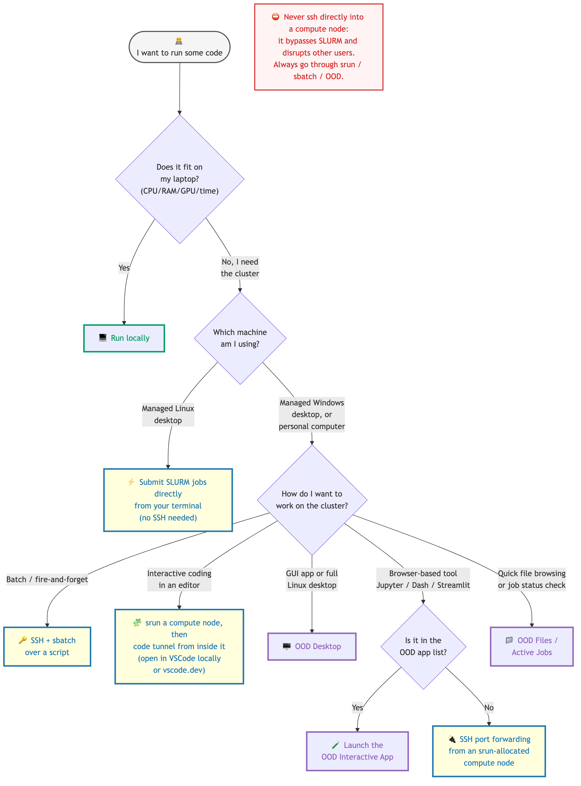

(where-to-run-target)=
# Choose where to run your code

We have several guides on running code at the SWC: SSH into the cluster,
VSCode with a SLURM job, `code tunnel`, Open OnDemand, port-forwarding…
This page is a short triage to help you pick the right tool **for a given
task**, with links to the relevant full guide.

```{include} ../_static/swc-wiki-warning.md
```

## The decision in one picture



Coloured outlines group the options by where the work actually happens:

- 🟢 **Green** — runs entirely on your local machine.
- 🔵 **Blue** — runs on the cluster, accessed through a terminal / SSH.
- 🟣 **Purple** — runs on the cluster, accessed through a browser (OOD).

:::{warning}
**Never `ssh` directly into a compute node** (e.g. `ssh gpu-sr670-21`).
The compute nodes are owned by whichever SLURM job is currently running on
them; a side-channel SSH session bypasses SLURM's resource accounting and
disrupts other users' work. Every option below either runs locally, runs
on the *gateway* node, or — when it needs a compute node — gets one
through `srun` / `sbatch` / OOD first.
:::

## When each option is the right one

### 🟢 Run locally
Pick this when the job fits comfortably on your laptop: small datasets,
no GPU (or a modest one), short runtimes, no need to share resources.
Local is always the simplest path — no queueing, no network, no quotas —
so prefer it when it's viable.

### 🔵 Submit SLURM jobs directly (managed Linux desktop)
If you sit at a [managed Linux desktop](https://liveuclac.sharepoint.com/sites/SSC/SitePages/SSC-Managed-Linux-Desktop-69502751.aspx),
you can call `srun` / `sbatch` straight from the terminal — no SSH needed,
because the desktop is already on the cluster's platform. See
{ref}`slurm-arguments-target` for the directives to use.

### 🔵 SSH + `sbatch` (script-driven, fire-and-forget)
The bread-and-butter HPC workflow: write an `sbatch` script, push your
code to the cluster, submit, walk away, collect outputs later.
Use this when the job is well-defined and you don't need to babysit it.
See {ref}`ssh-cluster-target` for setting up SSH, and {ref}`slurm-arguments-target`
for the script structure.

### 🔵 VSCode via `code tunnel` (inside a SLURM job)
The interactive-coding option: `srun` an interactive session on a compute
node, then run `code tunnel` **from inside that session**. You can then
attach to the tunnel either from your local VSCode (via the "Remote -
Tunnels" extension) or from `vscode.dev` in the browser, getting the full
IDE experience on real cluster resources. The full walkthrough is in
[Using VSCode with interactive SLURM jobs](vscode-with-slurm-job.md).

::: {warning}
This is the **only** sanctioned way to use VSCode against a compute node.
Do not run `code tunnel` on the gateway (it eats shared resources), and
do not connect VSCode's "Remote - SSH" extension directly to a compute
node hostname (it bypasses SLURM).
:::

### 🟣 OOD Desktop
A full Linux desktop, running on a compute node, accessed through the
browser. Use this when you need a **GUI** — matplotlib's interactive
backends, image viewers, MATLAB, anything that won't tunnel cleanly over
SSH — or when SSH/`code tunnel` aren't options on the machine you're
sitting at. See {ref}`open-ondemand-target`.

### 🟣 OOD Interactive App (Jupyter, RStudio, …)
If the tool you need is in the **Interactive Apps** menu on OOD, launch it
from there: the app runs on a compute node and the UI opens in a new
browser tab — no port-forwarding fiddly bits. See the
[Other Interactive Apps](Open-OnDemand-SWC.md#other-interactive-apps)
section of the OOD guide.

### 🔵 SSH port forwarding (from an `srun`-allocated compute node)
If the browser-based tool you want **isn't** in the OOD app list (a custom
Dash app, a Streamlit dashboard, a Jupyter Lab from a specific environment),
get a compute node via `srun`, launch the server **there**, and tunnel its
port back to your laptop. The tunnel itself uses SSH but you only ever
SSH into a node that SLURM has already assigned to you.
See [Accessing HTTP servers running on the HPC with port forwarding](port-fowarding.md).

### 🟣 OOD Files / Active Jobs
For a quick file browse, a one-off upload, an editor tweak, or just to see
whether your job is still running — the OOD dashboard is faster than
opening a terminal. No SLURM job needed. See the
[Files](Open-OnDemand-SWC.md#files) and [Jobs](Open-OnDemand-SWC.md#jobs)
sections of the OOD guide.

## Rules of thumb

- **Match the tool to the task, not the other way round.** Don't open OOD Desktop just to run a 5-second script; don't `sbatch` something you could test locally first.
- **Smaller is faster to start.** A 1-hour, 4-CPU `srun` queues faster than a 10-hour, 64-CPU one. Make your first attempt small.
- **Free resources you don't need.** Delete OOD sessions, `exit` from interactive jobs, cancel stuck jobs with `scancel`. Other people are waiting.
- **When in doubt, start with SSH + `sbatch`.** It's the most robust workflow, the easiest to script, and the one that least depends on a particular GUI tool being available.
